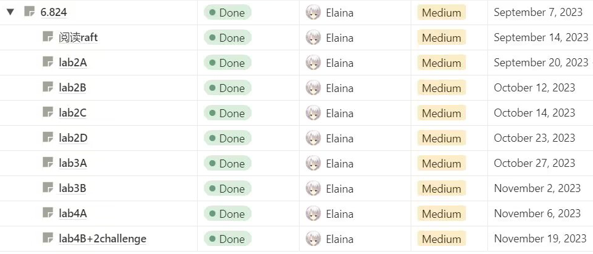
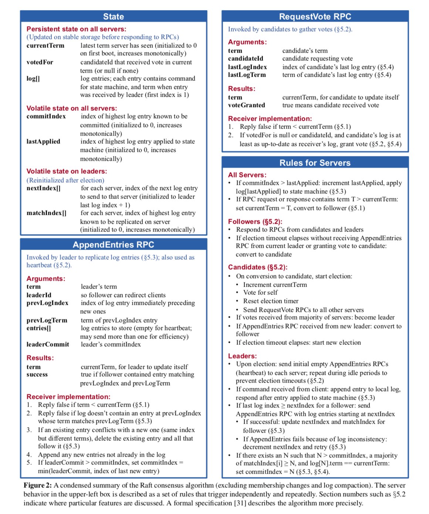
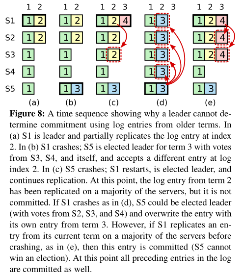
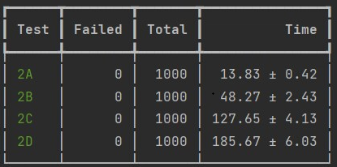
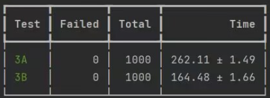
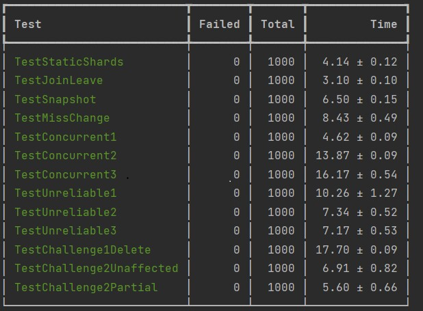

### 6.824完结总结



新手第一个lab，在此之前没接触过分布式（就是面试问到不会才开始补的QAQ），写得很乱，尽量保证参照要求和自己的理解完成，每个实验都并行跑了千轮未挂，目前完结到lab4 + 2个challenge done。

以前没接触过MIT的课程，感觉质量还是非常高的，lab很大程度锻炼了动手和思考能力，未来可能有时间会去补一下操作系统、软件工程等课程吧（先挖坑。。。。

各种各样原因，也可能是因为自己比较菜，写了长达两个月。。。共计耗时约150小时，总体来说难度挺高的lab，lab2 = lab4 > lab3 > lab1, bug调试比写代码的时间久，并发的情况很容易出现意外的情况，调试的过程中也学到了很多分布式的知识吧。

笔者水平有限，以前太摆了很少写这种总结性博客，有错误欢迎指出~~

### lab1 - MapReduce

简单的入门lab，顺便温习一下go语言的语法，理解了分而治之的原理后，很容易补全代码。

- 同个键经过Map分割映射后必定落在相同的桶下。
- 大任务划分成不同的桶后变成子任务，经过Reduce操作再合并结果。

### lab2 - Raft

lab2应该是这门课程中最重要也是最难的一个lab，比较容易劝退的一个环节，因为有很多细节上的问题需要考虑，想要一遍就写好几乎是不可能的，不过好在课程上给的测试函数很多，过不去就慢慢修bug嘛。

Raft是一种**分布式一致性共识**算法，共识算法的目标是确保系统中的所有节点就某个值或决策达成一致。基本思想是将系统中的节点划分为领导者（leader）、跟随者（follower）和候选人（candidate）三个角色。其中，领导者负责接收客户端请求并复制日志条目到其他节点，跟随者响应来自领导者的日志复制请求和候选人的选举请求，而候选人则负责发起选举请求以成为新的领导者。

Raft算法通过选举过程来确保始终存在一个领导者。当系统启动或者当前的领导者失效时，节点会进入选举过程，其中候选人会向其他节点发送选举请求。如果候选人获得多数节点的支持，它就会成为新的领导者。选举过程中使用了随机的超时机制，以避免选举冲突。

一旦选出领导者，它将负责接收客户端的请求，并复制日志条目到其他节点，以确保日志在系统中的一致性。当领导者接收到客户端的请求后，它会将该请求作为一个日志条目附加到自己的日志中，并将该日志条目复制到其他节点。一旦大多数节点确认复制成功，领导者就会将该请求应用到状态机中，并向客户端返回结果。

#### 2A 2B 选举和日志复制



2A和2B实现了Raft整体的基本功能，**整个流程都需要严格遵守figure2中提到的细节**，对于Raft节点的设计，总体上我写的比较乱，基本上是需要什么参数时就往结构体中添加相应的参数。（别忘了初始化）

```go
const noVoted = -1
const (
	Leader int32 = iota
	Candidate
	Follower
)

type Raft struct {
	Mu        deadlock.RWMutex    // Lock to protect shared access to this peer's state
	peers     []*labrpc.ClientEnd // RPC end points of all peers
	Persister *Persister          // Object to hold this peer's persisted state
	me        int                 // this peer's Index into peers[]
	dead      int32               // set by Kill()

	// Your Data here (2A, 2B, 2C).
	// Look at the paper's Figure 2 for a description of what
	// state a Raft server must maintain.
	role          int32         // 记录节点目前状态
	currentTerm   int           // 节点当前任期
	votedFor      int           // follower把票投给了哪个candidate
	voteCount     int           // 记录所获选票的个数
	HeartBeatChan chan struct{} // 心跳channel
	LeaderMsgChan chan struct{} // 当选Leader时发送
	VoteMsgChan   chan struct{} // follower收到选举信号时重置一下计时器

	// 2B
	commitIndex int           // Index of highest Logs entry known to be committed (initialized to 0, increases monotonically)
	lastApplied int           // Index of highest Logs entry applied to state machine (initialized to 0, increases monotonically)
	Logs        []LogEntries  // Logs Entries; each entry contains Command for state machine, and Term when entry was received by leader (first Index is 1)
	nextIndex   []int         // for each server, Index of the next Logs entry to send to that server (initialized to leader last Logs Index + 1)
	matchIndex  []int         //  for each server, Index of highest Logs entry known to be replicated on server (initialized to 0, increases monotonically)
	applyChan   chan ApplyMsg // 提交给客户端已完成半数复制的log
}

func Make(peers []*labrpc.ClientEnd, me int,
	persister *Persister, applyCh chan ApplyMsg) *Raft {
	rf := &Raft{
		Mu:            deadlock.RWMutex{},
		peers:         peers,
		Persister:     persister,
		me:            me,
		dead:          0,
		role:          Follower,
		currentTerm:   0,
		votedFor:      noVoted,
		voteCount:     0,
		HeartBeatChan: make(chan struct{}, chanLen),
		LeaderMsgChan: make(chan struct{}, chanLen),
		VoteMsgChan:   make(chan struct{}, chanLen),
		commitIndex:   0,
		lastApplied:   0,
		Logs:          []LogEntries{{}},
		nextIndex:     make([]int, len(peers)),
		matchIndex:    make([]int, len(peers)),
		applyChan:     applyCh,
	}
	// Your initialization code here (2A, 2B, 2C).
	// initialize from state persisted before a crash
	rf.readPersist(persister.ReadRaftState())
	go rf.Run()
	go rf.doApplyWork()
	return rf
}
```

Raft节点会启动两个go协程，Run中Raft节点会轮询按照自己的身份执行相应的操作，doApplyWork则是定期向客户端发送已经commit的日志。

选举和日志复制的流程作为Raft的核心，建议这部分仔细阅读论文中给出的要求细则，并在脑中模拟这个流程的实现。

最初，所有节点都处于Follower状态。每个节点都有一个当前的任期号，初始值为0。每个节点都有一个按照任期号排序的日志条目（log entries）。

每个Follower节点在一个随机化的时间（我的实现里采用300ms-600ms）内未收到来自Leader的心跳消息或其他Candidate的选举请求，便会进入选举状态。

Follower成为Candidate后会进入一个随机化时间的选举阶段，Candidate会增加当前的任期号，为自己投票，并在这段时间内向其他节点发送自己的选举请求，其他节点按照Term和日志的条件（参考figure2）选择是否对该选举请求进行投票。

如果一个Candidate收到一半以上节点的投票，则成为新的领导者，定期向Follower节点发送心跳信息维持自己的任期。

在这个流程中需要注意比较Term的大小，对于一个节点来说，不需要关注Term小的请求，并且在处理请求时需要时刻注意Term的更新。

```go
func (rf *Raft) sendRequestVote(server int, args *RequestVoteArgs, reply *RequestVoteReply) bool {
	ok := rf.peers[server].Call("Raft.RequestVoteHandler", args, reply)

	if !ok {
		return false
	}

	rf.Mu.Lock()
	defer rf.Mu.Unlock()
	defer rf.persist()

	// 如果已经不是candidate了，无须继续拉票。
	if rf.role != Candidate || args.Term != rf.currentTerm {
		return true
	}
	// 遇到了任期比自己大的节点，转为follower
	if reply.Term > rf.currentTerm {
		rf.ConvertToFollower(reply.Term)
		rf.VoteMsgChan <- struct{}{}
		return true
	}
	if reply.VoteGranted && rf.role == Candidate {
		rf.voteCount++
		if 2*rf.voteCount > len(rf.peers){
			rf.ConvertToLeader()
			// 超半数票 直接当选
			rf.LeaderMsgChan <- struct{}{}
		}
	}
	return true
}
```

```go
func (rf *Raft) RequestVoteHandler(args *RequestVoteArgs, reply *RequestVoteReply) {
	// Your code here (2A, 2B).
	rf.Mu.Lock()
	defer rf.Mu.Unlock()
	defer rf.persist()

	// 设置返回的任期，投票默认返回false。
	reply.Term = rf.currentTerm
	// 这里不加return 因为一个candidate一轮只发送一次选举。Follower收到了修改自己任期即可。
	// 后面可以继续参与投票。
	if args.Term > rf.currentTerm {
		rf.ConvertToFollower(args.Term)
		// 重置选票
		rf.votedFor = noVoted
	}
	// 双向影响，不接受任期小于的Candidate的投票申请
	if args.Term < rf.currentTerm {
		return
	}

	// Reply false if currentTerm < currentTerm
	// candidate’s Logs is at least as up-to-date
	lastLog := rf.GetLastLog()
	if args.LastLogTerm < lastLog.Term || args.LastLogTerm == lastLog.Term && args.LastLogIndex < lastLog.Index {
		return
	}

	// If votedFor is null or candidateId, and candidate’s Logs is at least as up-to-date as receiver’s Logs, grant vote
	if rf.role == Follower && (rf.votedFor == noVoted || rf.votedFor == args.CandidateId) {
		rf.votedFor = args.CandidateId
		reply.VoteGranted = true
		rf.VoteMsgChan <- struct{}{}
	}
}
```

日志复制这一部分就较为简单了，实验的步骤中给出Leader发送心跳的周期是100ms，在2B中增加在这个流程中发送最新的日志，Follower节点增加对自身日志的比对复制即可。

```go
func (rf *Raft) SendAllAppendEntries() {
	rf.mu.Lock()
	defer rf.mu.Unlock()

	for server := range rf.peers {
		if server != rf.me && rf.role == Leader {
			nxtId := rf.nextIndex[server]
			lastLog := rf.logs[nxtId-1]
			logs := make([]LogEntries, len(rf.logs)-nxtId)
			copy(logs, rf.logs[nxtId:])
			args := &AppendEntriesArgs{
				Term:         rf.currentTerm,
				LeaderId:     rf.me,
				PrevLogIndex: lastLog.Index,
				PrevLogTerm:  lastLog.Term,
				LeaderCommit: rf.commitIndex,
				Entries:      logs,
			}
			go func(id int, args *AppendEntriesArgs) {
				reply := &AppendEntriesReply{}
				rf.SendAppendEntries(id, args, reply)
			}(server, args)
		}
	}
}
```

##### Tips：

- 需要严格按照论文中给出的要求一步一步实现，如果实现中遇到了bug，不妨再重看一遍figure2，可能有意外收获。
- **访问资源时务必记得上锁**！！！可以将大锁拆分成读锁和写锁，进一步提高效率。善用go test -race 检查并发资源冲突的情况，**协程等待RPC或者Sleep的过程中不要上锁**！部分修改可以采用atomic库中的原子操作完成。
- RPC的到达可能由于网络环境是乱序的，此时必须思考如何排除掉旧消息，可以增加一个Term判断。

#### 2C 持久化

本身增加持久化的操作是不难的，只需要遵照论文figure2中的要求，在Raft节点每次处理完请求后增加一步持久化操作即可。

```go
func (rf *Raft) EncoderState() []byte {
	w := new(bytes.Buffer)
	e := labgob.NewEncoder(w)
	// 需要保存的内容
	if e.Encode(rf.currentTerm) != nil || e.Encode(rf.votedFor) != nil || e.Encode(rf.Logs) != nil {
		log.Fatal("Errors occur when raft Encoder")
	}
	data := w.Bytes()
	return data
}
```

```go
func (rf *Raft) readPersist(data []byte) {
	if data == nil || len(data) < 1 { // bootstrap without any state?
		return
	}
	r := bytes.NewBuffer(data)
	d := labgob.NewDecoder(r)
	var currentTerm int
	var voteFor int
	var logs []LogEntries
	if d.Decode(&currentTerm) != nil || d.Decode(&voteFor) != nil || d.Decode(&logs) != nil {
		log.Fatal("errors occur when Decoder")
	} else {
		rf.currentTerm = currentTerm
		rf.votedFor = voteFor
		rf.Logs = logs
	}
}
```

难点在于网络的复杂程度提高了，原有的问题在2B中检测不出来，在2C复杂的环境中都会暴露出来，2C是我lab2中卡的最久的一个阶段，此时的bug通常会几十轮才出现一次，需要使用助教给的脚本并发运行，然后多打日志，在日志中去排查问题。

2C中在网络环境复杂的情况下，遵照Raft原文中日志逐一回退比对显得太慢，在助教讲义中提到了按Term回退的策略。为Reply增加 ConflictTerm 和 ConflictIndex，回退时对于一组相同Term的日志只找最先的，可以少发很多RPC请求，提高系统效率。

```go
type AppendEntriesReply struct {
	Term          int
	Success       bool
	ConflictTerm  int
	ConflictIndex int
}

func (rf *Raft) SendAppendEntries(id int, args *AppendEntriesArgs, reply *AppendEntriesReply) {
	// ...省略一些处理逻辑...
    
	// 优化
	// 在收到一个冲突响应后，领导者首先应该搜索其日志中任期为 conflictTerm 的条目。
	// 如果领导者在其日志中找到此任期的一个条目，则应该设置 nextIndex 为其日志中此任期的最后一个条目的索引的下一个。
	// 如果领导者没有找到此任期的条目，则应该设置 nextIndex = conflictIndex。
	if !reply.Success {
		if reply.ConflictTerm == -1 {
			rf.nextIndex[id] = reply.ConflictIndex
		} else {
			flag := true
			for j := args.PrevLogIndex; j >= 0; j-- {
				if rf.logs[j].Term == reply.ConflictTerm {
					rf.nextIndex[id] = j + 1
					flag = false
					break
				} else if rf.logs[j].Term < reply.ConflictTerm {
					break
				}
			}
			if flag {
				rf.nextIndex[id] = reply.ConflictIndex
			}
		}
	} else {
		rf.nextIndex[id] = max(args.PrevLogIndex+len(args.Entries)+1, rf.nextIndex[id])
		rf.matchIndex[id] = max(args.PrevLogIndex+len(args.Entries), rf.matchIndex[id])
	}
}


func (rf *Raft) AppendEntriesHandler(args *AppendEntriesArgs, reply *AppendEntriesReply) {
	// ...省略一些处理逻辑...
    
	// 如果追随者的日志中没有 preLogIndex，它应该返回 conflictIndex = len(log) 和 conflictTerm = None。
	if args.PrevLogIndex >= len(rf.logs) {
		reply.ConflictTerm = -1
		reply.ConflictIndex = len(rf.logs)
		return
	}
	lastLog := rf.logs[args.PrevLogIndex]
	
	if args.PrevLogTerm != lastLog.Term {
		reply.ConflictTerm = lastLog.Term
		for j := args.PrevLogIndex; j >= 0; j-- {
			if rf.logs[j].Term != lastLog.Term {
				reply.ConflictIndex = j + 1
				break
			}
		}
		return
	}
	reply.Success = true
	
	// 这里要循环判断冲突再复制
	for idx := 0; idx < len(args.Entries); idx++ {
		curIdx := idx + args.PrevLogIndex + 1
		if curIdx >= len(rf.logs) || rf.logs[curIdx].Term != args.Entries[idx].Term {
			rf.logs = append(rf.logs[:curIdx], args.Entries[idx:]...)
			break
		}
	}
	if args.LeaderCommit > rf.commitIndex {
		rf.commitIndex = min(len(rf.logs)-1, args.LeaderCommit)
	}
}
```

2C中还有一个值得探讨的点是figure8，figure8用一个特殊的case阐述了为什么**Leader不能直接提交小于当前Term的日志，只能通过提交当前Term的日志间接提交先前日志**。


代码的实现很简单，只需要在commit的时候判断一下末尾日志是否与当前的任期Term匹配即可。

合理的解法还应该增加一个 no-op 流程，具体表现为在 Leader 刚选举成功的时候，立即追加一条 no-op 日志，并立即复制到其它节点，该日志不包含任何命令，no-op 日志一经提交，Leader 前面那些未提交的日志全部间接提交。防止系统由于长期未有新日志输入导致一直卡死的情况。

不过在6.824 中不需要实现 no-op 日志，否则测试会挂。

#### 2D 快照机制

按照目前的情况，重新启动的服务器会重放完整的 Raft 日志以恢复其状态。然而，对于一个长期运行的服务来说，永远记住完整的 Raft 日志是不切实际的。为了防止日志的无限制增长，需要对 Raft 引入快照机制，将已经提交的日志存入快照文件中，Leader也可以通过给Follower直接发送快照文件帮助落后的Follower复制最新的日志，此时提交的日志修改为：

```go
type ApplyMsg struct {
	CommandValid bool
	Command      interface{}
	CommandIndex int

	// For 2D:
	SnapshotValid bool
	Snapshot      []byte
	SnapshotTerm  int
	SnapshotIndex int
}
```

首先需要实现Snapshot函数，Raft 应丢弃 index 之前的日志条目，并保存快照文件。

```go
func (rf *Raft) Snapshot(index int, snapshot []byte) {
	// Your code here (2D).
	rf.Mu.Lock()
	defer rf.Mu.Unlock()
	snapShotIndex := rf.GetFirstLog().Index
	if snapShotIndex >= index {
		return
	}
	// rf.Logs[0]保留快照的lastLog
	// 释放大切片内存
	rf.Logs = append([]LogEntries{}, rf.Logs[index-snapShotIndex:]...)
	rf.Logs[0].Command = nil
	// 保存状态和日志
	rf.Persister.Save(rf.EncoderState(), snapshot)
}
```

2D中常见的错误还有**死锁**，这是由于test函数调用Snapshot()导致的，在向 applyChan 中提交日志时采用无锁化提交即可避免这个问题。

```go
func (rf *Raft) applyLog() {
	rf.Mu.Lock()
	SnapShotIndex := rf.GetFirstLog().Index
	
	if rf.commitIndex <= rf.lastApplied {
		rf.Mu.Unlock()
		return
	}
	copyLogs := make([]LogEntries, rf.commitIndex-rf.lastApplied)
	copy(copyLogs, rf.Logs[rf.lastApplied-SnapShotIndex+1:rf.commitIndex-SnapShotIndex+1])
	rf.lastApplied = rf.commitIndex
	rf.Mu.Unlock()
	
	for _, logEntity := range copyLogs {
		rf.applyChan <- ApplyMsg{
			CommandValid: true,
			Command:      logEntity.Command,
			CommandIndex: logEntity.Index,
		}
	}
}
```

然后整体没什么难度了，只需要在各个处理请求的场合考虑 SnapShotIndex 的偏移即可，然后在Leader处增加一个发送快照的分支，对`rf.nextIndex[server] <= SnapShotIndex`的server直接发送Leader的快照文件，Follower接受并读取快照文件，更新即可。

```go
if nxtId <= SnapshotLog.Index {
    args := &InstallSnapshotArgs{
        Term:              rf.currentTerm,
        LeaderId:          rf.me,
        LastIncludedIndex: SnapshotLog.Index,
        LastIncludedTerm:  SnapshotLog.Term,
        Data:              rf.Persister.ReadSnapshot(),
    }

    go func(id int, args *InstallSnapshotArgs) {
        reply := &InstallSnapshotReply{}
        rf.SendInstallSnapshotRpc(id, args, reply)
    }(server, args)
}
```

附上lab2的测试结果：



### lab3 - Key/Value Service

lab3 需要在 lab2 的基础上实现一个高可用的 KV 存储服务，属于开放式的设计lab。kvServer应该有由多个使用 Raft 进行复制的KvServer组成。只要大多数服务器处于活动状态并且可以通信，无论存在其他故障或网络分区，KvServer都应该继续处理客户端请求。

#### 3A

3A需要我们完成KvServer的基本功能，首先客户端可以将三种不同的 RPC 发送到 KvServer ： `Put(key, value)`、 `Append(key, arg)`和`Get(key)`。该服务维护一个简单的kv数据库。键和值都是字符串。 

- `Put(key, value)`替换数据库中特定键的值。
- `Append(key, arg)` 将 `arg` 附加到键的值后面。
- `Get(key)`获取键的当前值。`对不存在的键的 Get`应返回空字符串。

在开始lab3的实现之前，应该思考如何实现**线性一致性**，关于什么是线性一致性，lab指导中给出说明，如果一个客户端从服务获得更新请求的成功响应，则随后从其他客户端启动的读取一定会看到该更新的效果。简而言之就是任何一次读都能读到该数据最近的一次写操作。

更多的思考可以参考这位大佬的知乎回答：https://zhuanlan.zhihu.com/p/42239873

线性一致性的实现有很多,这里采用最简单的线性一致性读写：

> 所有的 read/write 都会来到 Leader，读写操作会对应一个 Op log，经过raft达成共识后按顺序返回，此时所有的读写操作都是有严格的顺序的，如果该读操作被apply了，那么在此之前的写操作也必定被apply，因此读到必定是最新的数据。

另外的实现也有读不进log的实现，但是需要额外维护一个commitIndex来保证读到的数据是最新的，分布式博大精深，这部分只能后面慢慢优化了~~~

为什么每个操作都需要走一遍Raft呢？经过Raft达成共识后的Op log，即使集群宕机（只要不超过半数以上）后也可以通过**多数节点复制**回到最新的状态，这就是lab3中所提到的容错。

##### 客户端

lab3中每个客户端一次只会向服务端发送一个请求，如果客户端没能返回成功的Rpc，则会一直重试直到该操作成功为止。由于读写操作最终都将进入Raft中去实现日志复制，因此客户端还需要记录一下哪个服务端是Leader。结构体定义如下，commandId记录一下这是该客户端的第几个命令，以便服务端辨别哪个是最新的命令。

```go
type Clerk struct {
	servers []*labrpc.ClientEnd
	// You will have to modify this struct.
	clerkId int64
	commandId int
	LeaderId int
}
```

客户端执行操作就没什么好说的，轮询执行直至服务端返回OK即可。

```go
func (ck *Clerk) Get(key string) string {
	// You will have to modify this function.
	ck.commandId++
	args := &GetArgs{
		Key:       key,
		ClerkId:   ck.clerkId,
		CommandId: ck.commandId,
	}
	// 轮询访问
	for {
		reply := &GetReply{}
		ok := ck.servers[ck.LeaderId].Call("KVServer.Get", args, reply)
		if ok && reply.Err == OK {
			return reply.Value
		} else {
			// 当前客户端网络异常，向其他客户端发送
			ck.LeaderId = (ck.LeaderId + 1) % len(ck.servers)
		}
		if ck.LeaderId%len(ck.servers) == 0 {
			time.Sleep(50 * time.Millisecond)
		}
	}
}
```

##### 服务端

对于键值的存储，我们很直观的可以使用一个map来完成上述对应的三种操作，关键在于如何保证客户端和服务器之间的通信。客户端和服务端之间的通信信息可以保存在一个Session的map中，用来保存这次通信的操作结果，客户端可以通过轮询查找这个map中判断服务端是否进行了回复。（这里为了实现并发读写就用了sync.Map，单纯用Map+读锁也是可以的）。而对于网络不稳定的环境，操作日志传进Raft并不代表最终一定会Commit，因此还需要设置超时机制向客户端提出重发请求。

```go
type KVServer struct {
	mu      deadlock.Mutex
	me      int
	rf      *raft.Raft
	applyCh chan raft.ApplyMsg
	dead    int32 // set by Kill()

	maxraftstate int // snapshot if log grows this big

	// Your definitions here.
	kvMemory       map[string]string
	Session        deadlock.Map
	opCh           chan Op
	lastApplyIndex int
}

type sessionResult struct {
	LastCommandId int
	Value         string
	Err           Err
}

func (kv *KVServer) Get(args *GetArgs, reply *GetReply) {
	// Your code here.
	_, isLeader := kv.rf.GetState()
	if !isLeader {
		reply.Err = ErrWrongLeader
		return
	}
	// 该请求仅查询LeaderId
	if args.Key == "" {
		reply.Err = OK
		return
	}
	defer DPrintf("kvServer receive Get Op args: %v reply: %v", args, reply)
	// 已经存放旧结果
	res := kv.getSessionResult(args.ClerkId)
	if res.LastCommandId == args.CommandId && res.Err == OK {
		reply.Err = OK
		reply.Value = res.Value
		return
	}
	op := Op{
		Key:       args.Key,
		Type:      "Get",
		ClerkId:   args.ClerkId,
		CommandId: args.CommandId,
	}
	kv.rf.Start(op)
	start := time.Now()
	for {
		if time.Since(start) >= TimeOut {
			reply.Err = ErrTimeOut
			return
		}
		res = kv.getSessionResult(args.ClerkId)
		if res.LastCommandId == args.CommandId && res.Err == OK {
			reply.Err = res.Err
			reply.Value = res.Value
			return
		}
		// 这里不要Sleep太久,否则过不了速度测试,取10ms间隔即可。
		time.Sleep(QueryTime)
	}
}
```

当操作日志通过Raft完成Commit时，此时已经完成了多数复制，那么此时服务端直接Apply即可。

```go
func (kv *KVServer) doApplyWork(msg raft.ApplyMsg) {
	kv.mu.Lock()
	defer kv.mu.Unlock()

	op, _ := msg.Command.(Op)
	term, isLeader := kv.rf.GetState()
	// 旧的日志消息
	if msg.CommandIndex <= kv.lastApplyIndex {
		return
	}

	kv.lastApplyIndex++
	defer DPrintf("Term %v node %v status %v receive ApplyLog:%v", term, kv.me, isLeader, msg)

	// 已有结果，直接返回即可。
	res := kv.getSessionResult(op.ClerkId)
	if res.LastCommandId >= op.CommandId {
		return
	}

	switch op.Type {
	case "Get":
		kv.Session.Store(op.ClerkId, sessionResult{
			LastCommandId: op.CommandId,
			Value:         kv.kvMemory[op.Key],
			Err:           OK,
		})
	case "Put":
		kv.kvMemory[op.Key] = op.Value
		kv.Session.Store(op.ClerkId, sessionResult{
			LastCommandId: op.CommandId,
			Value:         op.Value,
			Err:           OK,
		})
	case "Append":
		kv.kvMemory[op.Key] += op.Value
		kv.Session.Store(op.ClerkId, sessionResult{
			LastCommandId: op.CommandId,
			Value:         kv.kvMemory[op.Key],
			Err:           OK,
		})
	}
}
```

到这里3A基本已经完成了，在TestSpeed3A中可能会挂是因为客户端的查询间隔过长，或者是Raft中Leader在Start的时候没有立刻向Follower发送复制日志的请求导致的。TestOnePartition3A中会挂可能是因为客户端收到其他错误信息后没有切换LeaderId，此时可能存在一个孤立分区还未来得及更新的旧Leader节点。线性一致会挂注意判断每次操作的CommandId，每次服务端执行的操作的Index保证对应于lastApplyIndex+1，如果Raft提交是乱序的话，则需要重新修正Raft代码。

具体的bug只能靠不断调试去改正了！！！

#### 3B 

快照机制很简单，只需要在服务端增加持久化操作和读取快照的函数即可，此时会多出一种读取快照的操作，2D中已经为我们排除了快照的异常情况，3B在服务端直接接受快照文件即可。当然，保存快照不可能每次执行操作时都去做，只有在`kv.maxraftstate != -1 && kv.rf.RaftStateSize() >= kv.maxraftstate `时去执行。

**持久化中应该保存kvMemory和Session中的信息。**

附上lab3的测试结果：




### lab4 - ShardKV

在lab4中，我们将实现一个分片kv系统。ShardKV是一种分布式键值数据库，它将数据分割成多个分片，并将每个分片分配到不同的节点上进行存储和处理。每个节点负责管理其中一个或多个分片，并处理与这些分片相关的操作。这样，ShardKV充分利用了多个节点的存储和计算资源，提高系统的总吞吐量。

#### 4A

这部分需要实现分片总控制器的构建，分别对应 Join 、Leave、Move、Query 四种操作，还是非常简单的，因为客户端的操作直接copy lab3中的实现即可，Query操作返回指定下标的Config，Move实现简单移动就不多说了。

其中Join和Leave需要涉及重新平衡分组的操作，我是暴力地每次取出载荷最大的组和载荷最小的组，通过转移的方法实现分片的平衡。

```go
for {
		mxGid, miGid := getMaxFrequent(cnt, keys), getMinFrequent(cnt, keys)
		if cnt[mxGid]-cnt[miGid] <= 1 {
			break
		}
		for i := range conf.Shards {
			if conf.Shards[i] == mxGid {
				conf.Shards[i] = miGid
				cnt[mxGid]--
				cnt[miGid]++
				break
			}
		}
	}
```

##### Tips：

- **注意结构体Config的map要采取深拷贝**，否则引用的都是同一个map。

- map访问是乱序的，为了防止其他节点出现不一样的结果，最好存一份排序后的key，保证结果一致。

#### 4B

这部分需要构建ShardKV的主体部分，4个lab中最容易出错也是最考察耐心的地方，在Raft中还可以对照论文比较细节，在4B出错只能自己思考方案的可行性了，在重构调bug的时候也阅读了很多博客中的设计思路和想法，以及共同踩过的一些坑，这部分确实给我的调试提供了很大的帮助。

##### 客户端

客户端总体还是跟lab3中保持一致，每个client在同一时刻只有一个操作，轮询像服务端发送请求Rpc即可。因为后面需要实现分片迁移等操作，因此对于存储的数据，我们最好按照分片去划分成独立的分区。在客户端的Rpc可以额外携带一个shard标志此次操作对应的分片号，同样的服务端也需要按照分片号找到对应的片内存储进行操作，其余的逻辑直接把lab3的代码复制过来就好。

##### 服务端

可以继续延续lab3中的思路，上层应用继续将一些操作送进Raft下层，首先应该明确的是**所有会改变状态的操作**都应该放到Raft中去做共识后才可以应用到上层应用，只有这样才可以保证故障后可以按照日志还原到相同的状态。

在lab4中，除了自带的Get、Put和 Append操作，4B中要求我们让服务器监视配置更改，并在检测到配置更改时启动分片迁移过程。所以，服务端还应定期向4A中实现的分片控制器拉取最新的分片配置，如果发现配置需要更新，此处需要新增一个关于UpdateConfig的操作。

```go
type UpdateConfigOp struct {
	// UpdateConfiguration
	Config shardctrler.Config
}

func (kv *ShardKV) ShardCtrlerPullConfig() {
	for !kv.killed() {
		if kv.isLeader() {
			kv.mu.RLock()
			check := kv.checkUpdateConfig()
			configNum := kv.CurrentConfig.Num
			kv.mu.RUnlock()

			if check {
				conf := kv.mck.Query(configNum + 1)
				if conf.Num == configNum+1 {
					kv.rf.Start(Command{
						Role: UpdateConfiguration,
						Op:   UpdateConfigOp{Config: conf},
					})
				}
			}

		}
		time.Sleep(CheckTime)
	}
}

// 此时如果存在分片拉取行动，阻止拉取新日志
func (kv *ShardKV) checkUpdateConfig() bool {
	for _, status := range kv.Status {
		// 处于过渡态时不允许拉取新日志
		if status == Pulling || status == Pushing {
			return false
		}
	}
	return true
}

func (kv *ShardKV) doUpdateConfigurationWork(lastApplyIndex int, op UpdateConfigOp) {
	// 按顺序拉取
	conf := op.Config
	kv.mu.Lock()
	defer kv.mu.Unlock()
	defer kv.persist(lastApplyIndex)
	// 只更新最新的日志
	if conf.Num != kv.CurrentConfig.Num+1 || !kv.checkUpdateConfig() {
		return
	}
	defer DPrintf("node %v Update Config %v get Status %v", kv.me, conf, kv.Status)
	// 更新新配置
	kv.PrevConfig = kv.CurrentConfig
	kv.CurrentConfig = conf

	for i := range conf.Shards {
		if kv.PrevConfig.Shards[i] != kv.gid && kv.CurrentConfig.Shards[i] == kv.gid {
			if kv.PrevConfig.Shards[i] == 0 {
				kv.Status[i] = Serving
			} else {
				kv.Status[i] = Pulling
			}

		}

		if kv.PrevConfig.Shards[i] == kv.gid && kv.CurrentConfig.Shards[i] != kv.gid {
			if kv.CurrentConfig.Shards[i] == 0 {
				kv.Status[i] = Delete
			} else {
				kv.Status[i] = Pushing
			}
		}
	}
}

```

更新完分片配置后，服务端还应该解决配置更改问题。这里存在两种关系，一方需要将分片发送出去，而另一方需要将分片接收进来。此时我们还应该额外设计分片的状态用来标记该分片此时所做的任务。 正常服务的分片状态应该为Serving，分片迁移时发送方设置为Pushing，而接收方设置为Pulling，在完成分片转移后，Challenge1要求我们要按时删掉发送方的分片数据（此时发送方已失去所有权了），完成删除后的正常状态为Delete。**显然只有当分片状态为Serving时，才可以执行Get、Put和 Append操作，否则应该等待分片迁移结束。**

```go
type ShardStatus int

const (
	Serving ShardStatus = iota
	Pulling
	Pushing
	Delete
)
```

分片转移的大致流程如下，既然分片迁移时有发送方和接收方，那么我们就需要额外定义一个MoveShard的分片转移操作向发送方索要分片数据，类似拉取最新分片配置一样，启动一个协程定期扫描服务器内的分片状态，一旦发现当前分片状态为Pulling，就向发送方拉取分片数据，一旦拉取成功，则修改当前状态为Serving并正常提供服务。

此时接收方的状态可以修改为正常服务，发送方还为Pushing，那应该怎么办呢？同样的我们也可以再启动一个协程定期扫描服务器内的分片状态，一旦发现当前分片状态为Pushing，则向接收方询问是否已经接收到该分片，如果已经接收，则修改状态为Delete，并执行清理工作。

通过互相发送Rpc的一套流程下来，发送方和接收方最终都可以完成状态的改变，而在这个过程中，需要注意的是，**必须按顺序一次处理一个re-configurations**，Config必须在所有分片都是Serving或者Delete的时候才可以更新，在分片迁移时应停止拉取，按下标顺序依次处理。

```go
type Command struct {
    //  Role中记录操作类型，方便Run中执行相应逻辑。
	Role OpType
	Op   interface{}
}

type MoveShardOp struct {
	// MoveShard
	Shard int
	Data  []byte
	Num   int
}

type DeleteShardOp struct {
	// MoveShard
	Shard int
	Num   int
}

func (kv *ShardKV) MoveShardWorker() {
	for !kv.killed() {
		if kv.isLeader() {
			kv.mu.RLock()
			wg := sync.WaitGroup{}
			for i := range kv.Status {
				if kv.Status[i] == Pulling {
					// 向谁拉取
					wg.Add(1)
					preGid := kv.PrevConfig.Shards[i]
					args := &ShardArgs{
						Gid:       kv.gid,
						Shard:     i,
						ConfigNum: kv.CurrentConfig.Num,
					}
					var groups []string
					groups = append(groups, kv.PrevConfig.Groups[preGid]...)
					go func() {
						kv.SendMoveShardRpc(groups, args)
						wg.Done()
					}()
				}
			}
			kv.mu.RUnlock()
			wg.Wait()
		}
		time.Sleep(MoveShardTime)
	}
}

func (kv *ShardKV) DeleteShardWorker() {
	for !kv.killed() {
		if kv.isLeader() {
			kv.mu.RLock()
			wg := sync.WaitGroup{}
			for i := range kv.Status {
				if kv.Status[i] == Pushing {
					wg.Add(1)
					// 向谁询问
					curGid := kv.CurrentConfig.Shards[i]
					args := &ShardArgs{
						Gid:       kv.gid,
						Shard:     i,
						ConfigNum: kv.CurrentConfig.Num,
					}
					var groups []string
					groups = append(groups, kv.CurrentConfig.Groups[curGid]...)
					go func() {
						kv.SendDeleteShardRpc(groups, args)
						wg.Done()
					}()
				}
			}
			kv.mu.RUnlock()
			wg.Wait()
		}
		time.Sleep(DeleteShardTime)
	}

}
```

当设计的分片迁移策略可以完美生效时，此时已经接近尾声了，在测试的时候偶尔还是会在TestConcurrent3中挂掉，查阅其他人的解决方案后才发现原来是活锁的问题，当系统因为宕机后恢复时，此时如果系统中没有新的日志输入，那么Raft是不能提交旧日志的（figure8），整个系统会进入静止的状态。解决方案很简单，在2B时就提到了新任期时Leader可以发送一个Nop来提交先前的日志，但是在2B中添加了会挂test，那么我们索性在应用层加就行了，每隔一段时间检查日志的最后一个entity的任期是否和当前Leader一样，否则就做一个空的Nop操作。

```go
// NopWorker 避免活锁定期发送Nop
func (kv *ShardKV) NopWorker() {
	for !kv.killed() {
		Term, isLeader := kv.rf.GetState()
		kv.rf.Mu.RLock()
		check := Term != kv.rf.GetLastLog().Term
		kv.rf.Mu.RUnlock()
		if isLeader && check {
			kv.rf.Start(Command{
				Role: Nop,
			})
		}
		time.Sleep(NopTime)
	}
}
```

结构体的定义如下

```go
type ShardKV struct {
	mu           deadlock.RWMutex
	me           int
	rf           *raft.Raft
	applyCh      chan raft.ApplyMsg
	make_end     func(string) *labrpc.ClientEnd
	gid          int
	ctrlers      []*labrpc.ClientEnd
	maxraftstate int // snapshot if log grows this big

	// Your definitions here.
	dead int32
	// 按照shard分片去划分map
	kvMemory [shardctrler.NShards]map[string]string
	Status   [shardctrler.NShards]ShardStatus
	
	Session          [shardctrler.NShards]map[int64]chan SessionResult
	LastCommandIndex [shardctrler.NShards]map[int64]int
	mck              *shardctrler.Clerk
	PrevConfig       shardctrler.Config
	CurrentConfig    shardctrler.Config

	LastSpotIndex int
}
func (kv *ShardKV) Run() {
	for !kv.killed() {
		select {
		case applyEntity := <-kv.applyCh:
			cmd, _ := applyEntity.Command.(Command)

			switch cmd.Role {
			case KvOp:
				// 这里需要保证线性执行 不要并发
				if applyEntity.SnapshotValid {
					kv.readPersist(applyEntity.Snapshot, applyEntity.SnapshotIndex)
				} else {
					op, _ := cmd.Op.(KVOp)
					kv.doApplyWork(applyEntity.CommandIndex, op)
				}
			case MoveShard:
				op, _ := cmd.Op.(MoveShardOp)
				kv.doMoveShardWork(applyEntity.CommandIndex, op)
			case UpdateConfiguration:
				op, _ := cmd.Op.(UpdateConfigOp)
				kv.doUpdateConfigurationWork(applyEntity.CommandIndex, op)
			case DeleteShard:
				op, _ := cmd.Op.(DeleteShardOp)
				kv.doDeleteShardWork(applyEntity.CommandIndex, op)
			case Nop:
				continue

			}
		case <-time.After(QueryTime):
			continue
		}
	}
}
```

##### Tips：

- 只有Leader才可以调用`rf.Start()`发起共识，而应用Op操作时是所有节点都可以做的。
- 我在lab3中采用直接将结果输送进map中供客户端查询的做法无法通过Challenge1，正好爆内存了，改成用channel通信就可以解决了。
- 按顺序一次处理一个更新配置，处理Rpc时记得先比较两者的Config是否对的上，还应检查对应的分片状态，避免重复操作和应用过期操作。

附上4B的测试结果：



附上一些非常有用的参考资料：

- 课程链接 http://nil.csail.mit.edu/6.824/2022/index.html
- 并行调试脚本 https://blog.josejg.com/debugging-pretty/
- 助教讲义 https://thesquareplanet.com/blog/students-guide-to-raft/
- 知乎6.824通关记录 https://zhuanlan.zhihu.com/p/631386296
- 6.824的lab笔记 https://github.com/OneSizeFitsQuorum/MIT6.824-2021

##### 写在最后

下一个lab可能会去做6.s081吧，把os的部分补一补，如果还有时间的话再做一下数据库相关的，然后就得找实习了emmmmmmmm
